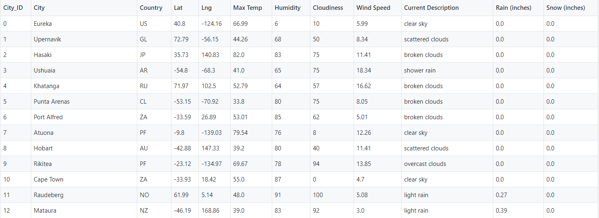
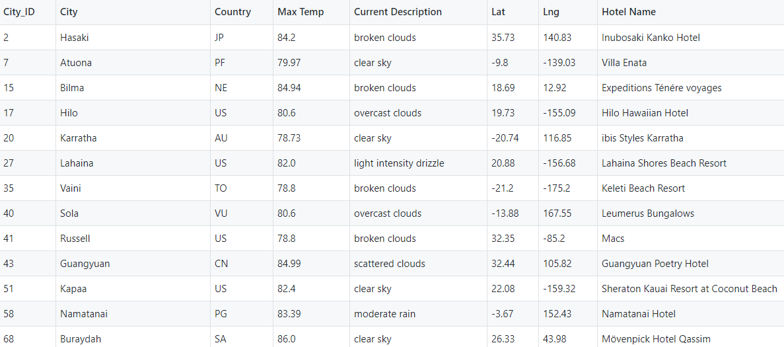
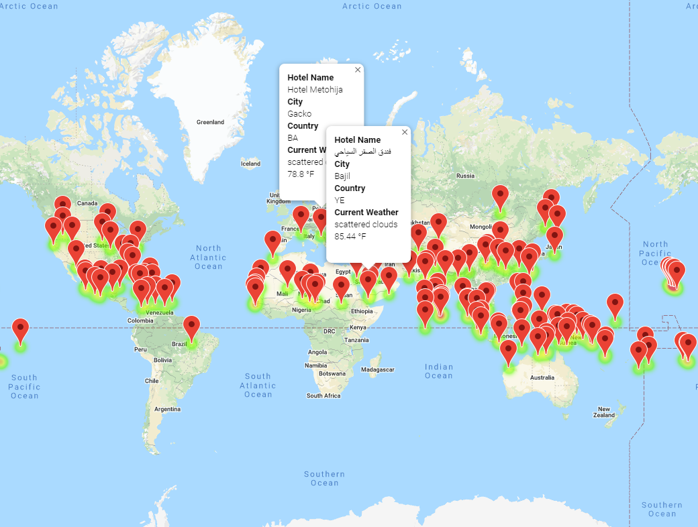
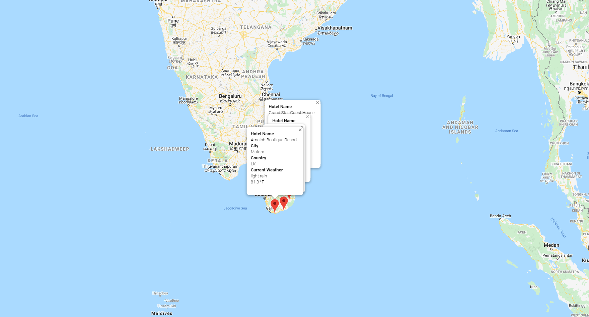
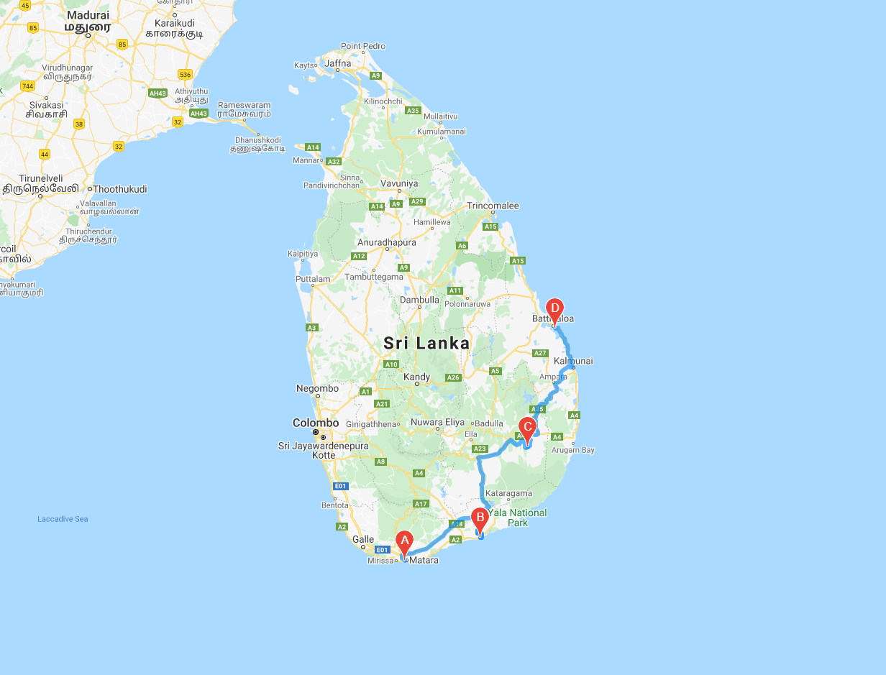

# World_Weather_Analysis
---
## Resources
Data Source: https://openweathermap.org/api  
Software: Python, API, JSON, Jupyterm Pandas, CityPy, Python Requests  

---

## Summary
Created a basic app interface for a user to request information about weather conditions in a randomly selected set of cities using openweathermap.org API.  Then mapped those cities with Google's API and included pop-up markers for customers and created another layer showing the driving route amongst the selection.  The customers also requested to know if there was precipitation (rain or snow) in the selected cities.  

---

### Part 1 - Build city database and match weather to locations
Generated a set of 1500+ locations, matched those geo coords to the nearest city with CityPy.  Then gathered weather information into a Pandas DataFrame to provide the information for the new App features.  
### Weather App DataFrame  
  

### Part 2 - Refine with vacation search criteria  

Set up conditions to consume customer preferences based on temperature ranges and precipitation that are used to narrow search criteria.  Used Google Maps API to match locations with available hotels.  Returned this in a new DataFrame and built heatmaps based on customer criteria and search results.   

  
  

---

### Part 3 - Travel Itinerary  

Finally, selected four cities to create travel routing using Google Maps API.  

  
  
